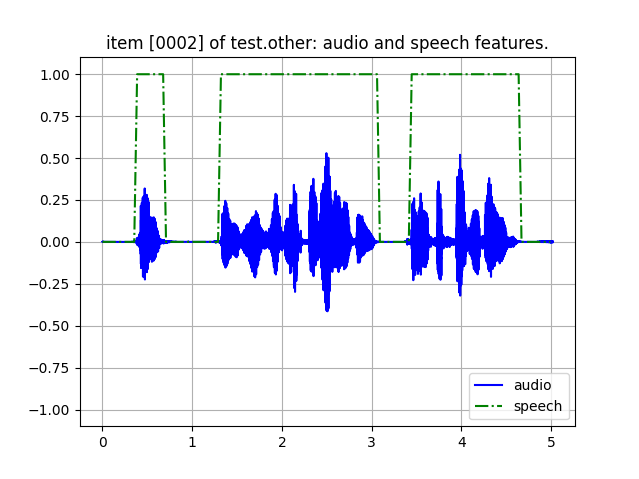

librispeech_asr_test_vad

A test dataset for voice activity detection.  This repo provides a working
test example.

Dataset Card on HuggingFace.
https://huggingface.co/datasets/guynich/librispeech_asr_test_vad

# Introduction

This dataset uses test splits [`test.clean`, `test.other`] extracted
from the
[`librispeech_asr` dataset](https://huggingface.co/datasets/openslr/librispeech_asr).

The additional feature is a binary classification of speech activity, called
`speech`.  These binary values [0, 1] were computed from the dataset audio
samples using a dynamic threshold method with background noise estimation.



The chunk size is 512 audio samples for each `speech` feature.

# Installation

This section describes installation for the working test example in this repo.

The first step is to clone this repo.
```console
cd
git clone git@github.com:guynich/librispeech_asr_test_vad.git
```

The main script has dependencies.  For these steps I used Ubuntu 22.04 and
Python `venv` virtual environment.
```console
sudo apt install -y python3.10-venv
sudo apt-get install python3-tk

cd
python3 -m venv venv_librispeech_asr_test_vad
source ./venv_librispeech_asr_test_vad/bin/activate

cd librispeech_asr_test_vad

python3 -m pip install --upgrade pip
python3 -m pip install -r requirements.txt
```

# Run the test script

```console
cd
source ./venv_librispeech_asr_test_vad/bin/activate
cd librispeech_asr_test_vad

python3 main.py
```
