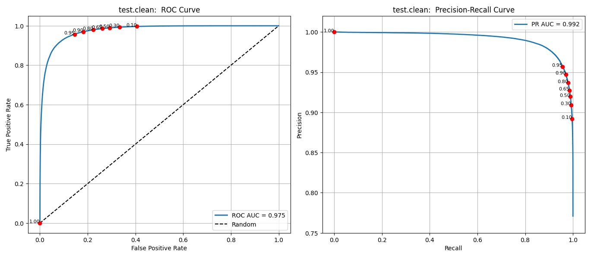
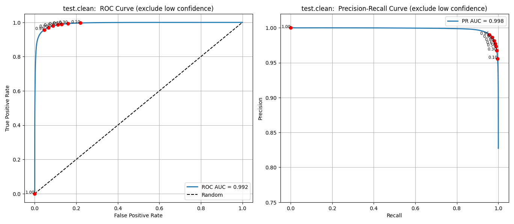
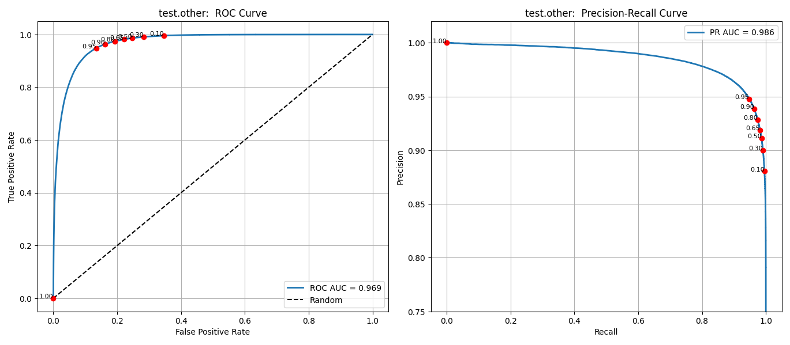
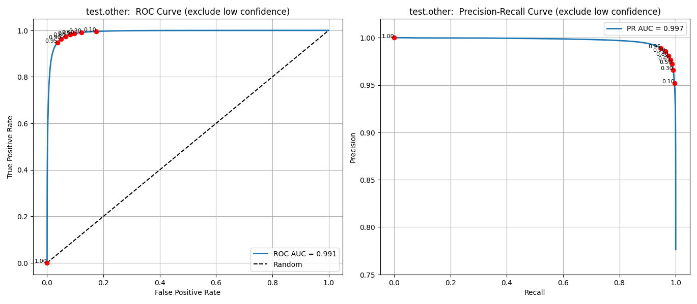

AUC metrics example

Dataset Card on HuggingFace.
https://huggingface.co/datasets/guynich/librispeech_asr_test_vad

Model: Silero VAD
https://github.com/snakers4/silero-vad

# Introduction

This repo computes AUC metrics for the test dataset with Silero VAD model.

# Installation

This section describes installation for the working test example in this repo.

The first step is to clone this repo.
```console
cd
git clone git@github.com:guynich/vad_eval_curves.git
```

The main script has dependencies.  For these steps I used Ubuntu 22.04 and
Python `venv` virtual environment.  The script plots require tkinter.
```console
sudo apt install -y python3.10-venv
sudo apt-get install python3-tk

cd
python3 -m venv venv_vad_eval_curves
source ./venv_vad_eval_curves/bin/activate

cd vad_eval_curves

python3 -m pip install --upgrade pip
python3 -m pip install -r requirements.txt
```

# Run the test script

Coded with help from ChatGPT and Copilot.

```console
cd
source ./venv_vad_eval_curves/bin/activate
cd vad_eval_curves

python3 main.py
```

## Results

### test.clean



Speech features marked as low confidence are excluded in the following plot.  See
[Dataset Card](https://huggingface.co/datasets/guynich/librispeech_asr_test_vad)
for discussion.



### test.other



Speech features marked as low confidence are excluded in the following plot.  See
[Dataset Card](https://huggingface.co/datasets/guynich/librispeech_asr_test_vad)
for discussion.



```
Overall results:
{'test.clean': AUCMetrics(roc_auc=np.float64(0.9749640109150584),
                          pr_auc=np.float64(0.9916534112871564)),
 'test.clean_confidence': AUCMetrics(roc_auc=np.float64(0.9922608881991464),
                                     pr_auc=np.float64(0.998258606740065)),
 'test.clean_confidence_count': 565340,
 'test.clean_count': 606609,
 'test.other': AUCMetrics(roc_auc=np.float64(0.9690341904686337),
                          pr_auc=np.float64(0.9856188107560578)),
 'test.other_confidence': AUCMetrics(roc_auc=np.float64(0.9914300825284824),
                                     pr_auc=np.float64(0.9971949352151593)),
 'test.other_confidence_count': 555324,
 'test.other_count': 599505}

test.clean has 5.39 hours of active speech with 93.20% labelled confidence 1
test.other has 5.33 hours of active speech with 92.63% labelled confidence 1
```
